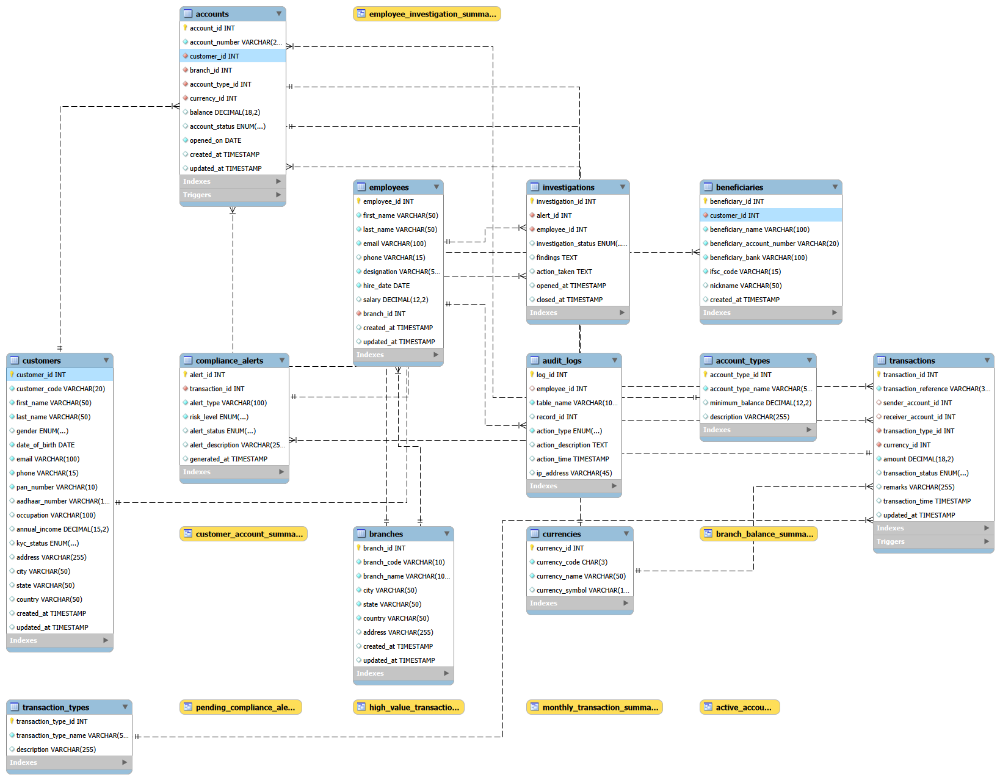
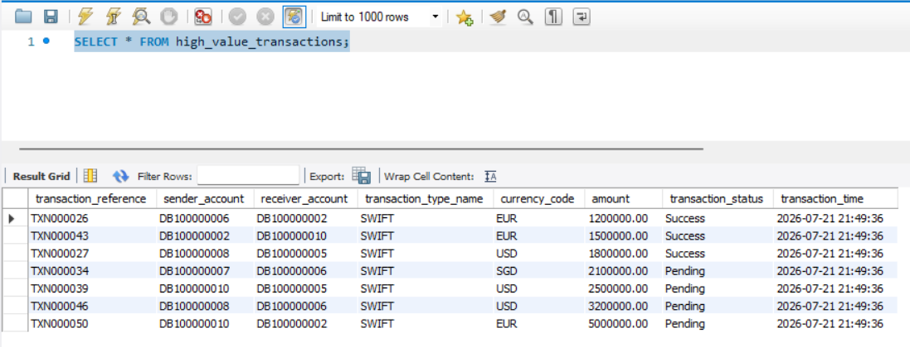
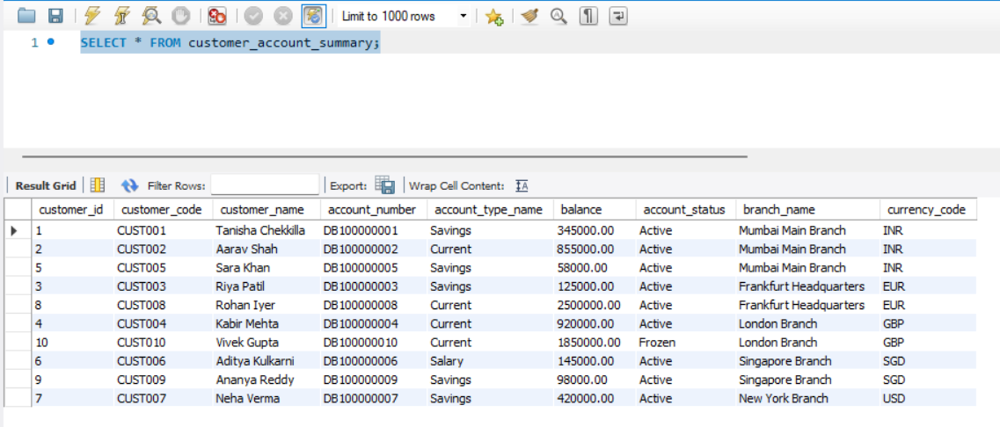
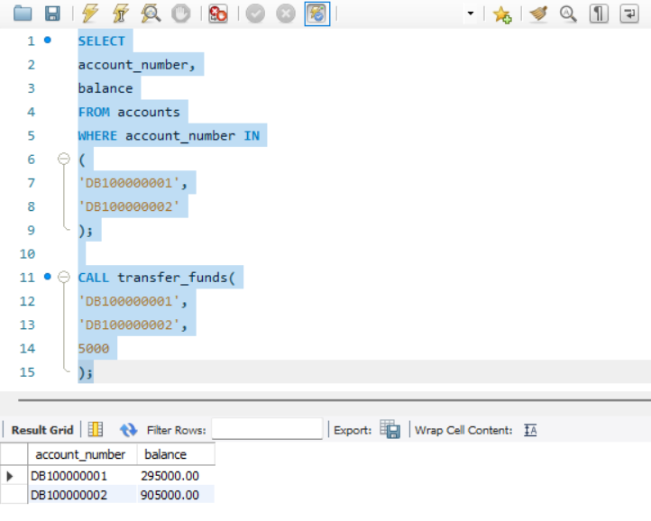
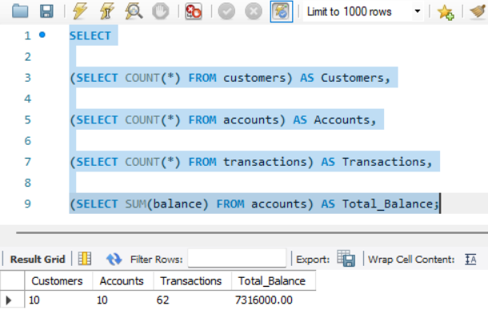

# 🏦 SecureTransact

### Banking Compliance & Transaction Monitoring Database

A real-world SQL project that simulates a banking transaction monitoring system. The project demonstrates database design, compliance monitoring, transaction processing, auditing, reporting, and advanced SQL analytics using MySQL.

## 📌 Project Overview

SecureTransact is a banking database system designed to simulate how financial institutions manage customer accounts, transactions, compliance monitoring, and audit logging.

The project focuses on secure transaction management while demonstrating practical SQL concepts such as stored procedures, triggers, views, indexes, window functions, Common Table Expressions (CTEs), and analytical reporting.

It is designed as a portfolio project to showcase SQL database design and advanced querying skills for enterprise-level applications.

## ✨ Key Features

- Customer Management with KYC details
- Multi-branch Banking Database Design
- Account Creation and Balance Management
- Secure Fund Transfer using Stored Procedures
- Deposit and Withdrawal Operations
- Automatic Compliance Alerts for High-Value Transactions
- Audit Logging using Database Triggers
- Customer Transaction History Tracking
- Branch-wise Customer and Account Management
- High-Value Transaction Monitoring
- Executive Reporting using SQL Views
- Performance Optimization using Indexes
- Advanced SQL Analytics using Window Functions
- Common Table Expressions (CTEs) for Business Analysis
- Ranking, Running Totals, and Trend Analysis

## 🛠 Technologies Used

| Category        | Technology                  |
|-----------------|-----------------------------|
| Database        | MySQL 8.0                   |
| Language        | SQL                         |
| IDE             | MySQL Workbench             |
| Database Design | Relational Database (RDBMS) |
| Version Control | Git & GitHub                |
| Documentation   | Markdown (README)           |

---

## 💡 SQL Concepts Demonstrated

- Database Design & Normalization
- Primary Keys & Foreign Keys
- Constraints (UNIQUE, CHECK, NOT NULL)
- Joins (INNER JOIN)
- Aggregate Functions
- GROUP BY & HAVING
- Views
- Stored Procedures
- Triggers
- Indexes
- Transactions (COMMIT)
- Window Functions
- Common Table Expressions (CTEs)
- Ranking Functions (`RANK()`, `DENSE_RANK()`, `ROW_NUMBER()`)
- Analytical Functions (`LAG()`, `LEAD()`, `SUM() OVER()`)

---

# 🗄 Database Schema

The SecureTransact database is designed using relational database principles and consists of **12 interconnected tables**. Each table represents a core banking entity and is linked using primary and foreign key relationships to maintain data integrity.

| Table | Purpose |
|-------|---------|
| **branches** | Stores information about bank branches located in different cities and countries. |
| **employees** | Maintains employee records responsible for banking operations and compliance investigations. |
| **customers** | Stores customer personal information, KYC status, and contact details. |
| **account_types** | Defines different account categories such as Savings, Current, Salary, and Fixed Deposit. |
| **currencies** | Stores supported currencies for domestic and international transactions. |
| **accounts** | Maintains customer bank accounts, balances, account status, and branch information. |
| **beneficiaries** | Stores beneficiary details for fund transfers. |
| **transaction_types** | Defines different transaction modes such as UPI, NEFT, RTGS, IMPS, SWIFT, etc. |
| **transactions** | Records every financial transaction performed between accounts. |
| **compliance_alerts** | Automatically stores alerts generated for suspicious or high-value transactions. |
| **investigations** | Tracks compliance investigations assigned to employees. |
| **audit_logs** | Maintains audit records of important database activities for traceability. |

---

## 🔗 Entity Relationship

The database follows a normalized relational structure where:

- One customer can own multiple bank accounts.
- Each account belongs to one branch.
- Each transaction is associated with a sender account and a receiver account.
- High-value transactions automatically generate compliance alerts.
- Compliance alerts can be assigned to employees for investigation.
- Audit logs maintain records of important database activities for accountability.

---

# 📂 Project Structure

```text
SecureTransact/
│
├── README.md
├── LICENSE
├── .gitignore
│
├── sql/
│   ├── 01_create_database.sql
│   ├── 02_create_tables.sql
│   ├── 03_insert_master_data.sql
│   ├── 04_insert_sample_data.sql
│   ├── 05_views.sql
│   ├── 06_stored_procedures.sql
│   ├── 07_triggers.sql
│   ├── 08_indexes.sql
│   ├── 09_reports.sql
│   ├── 10_test_queries.sql
│   └── 11_advanced_sql_queries.sql
│
└── docs/
    ├── er-diagram.png
    ├── 01_database_tables.png
    ├── 02_customer_count.png
    ├── 03_account_count.png
    ├── 04_transaction_count.png
    ├── 05_compliance_alert_count.png
    ├── 06_customer_data.png
    ├── 07_account_data.png
    ├── 08_high_value_transactions.png
    ├── 09_customer_account_summary.png
    ├── 10_balance_check_procedure.png
    ├── 11_transfer_funds_procedure.png
    ├── 12_freeze_account_procedure.png
    ├── 13_transaction_history_procedure.png
    ├── 14_executive_dashboard.png
    ├── 15_high_risk_alerts.png
    └── ...
```

---

---

# 🚀 How to Run

## Prerequisites

Before running this project, ensure the following software is installed:

- MySQL Server 8.0 or later
- MySQL Workbench
- Git (optional, for cloning the repository)

---

## Installation Steps

### 1. Clone the Repository

```bash
git clone https://github.com/<your-username>/SecureTransact.git
```

Or download the ZIP file and extract it.

---

### 2. Open MySQL Workbench

Connect to your local MySQL server.

---

### 3. Execute SQL Scripts in Order

Run the SQL files sequentially:

1. `01_create_database.sql`
2. `02_create_tables.sql`
3. `03_insert_master_data.sql`
4. `04_insert_sample_data.sql`
5. `05_views.sql`
6. `06_stored_procedures.sql`
7. `07_triggers.sql`
8. `08_indexes.sql`
9. `09_reports.sql`
10. `10_test_queries.sql`
11. `11_advanced_sql_queries.sql`

> **Note:** Execute the files in the above order to avoid dependency issues.

---

### 4. Verify Database Creation

Run the following SQL commands:

```sql
USE secure_transact_db;

SHOW TABLES;

SELECT COUNT(*) AS total_customers FROM customers;

SELECT COUNT(*) AS total_accounts FROM accounts;

SELECT COUNT(*) AS total_transactions FROM transactions;
```

If all scripts execute successfully, the database will contain:

- 12 relational tables
- Sample banking data
- SQL Views
- Stored Procedures
- Triggers
- Indexes
- Advanced SQL Queries

---

# 📸 Project Screenshots

The following screenshots demonstrate the successful implementation and execution of the project.

## Entity Relationship Diagram



---

## Database Tables


---

## High Value Transactions



---

## Customer Account Summary



---

## Transfer Funds using Stored Procedure



---

## Executive Dashboard



---

# 📊 Advanced SQL Features

This project demonstrates several advanced SQL concepts commonly used in enterprise banking systems.

| Feature | Description |
|---------|-------------|
| Window Functions | Used `RANK()` and `SUM() OVER()` for customer ranking and running transaction totals. |
| Common Table Expressions (CTEs) | Simplified complex analytical queries for high-value customers. |
| Views | Created reusable views such as `high_value_transactions` and `customer_account_summary`. |
| Stored Procedures | Implemented reusable procedures for fund transfers, account balance checks, account freezing, and transaction history. |
| Triggers | Automatically generated compliance alerts and audit logs based on business rules. |
| Indexes | Improved query performance on frequently searched columns. |
| Transactions | Ensured atomic fund transfers using `START TRANSACTION` and `COMMIT`. |
| Constraints | Used `PRIMARY KEY`, `FOREIGN KEY`, `CHECK`, `UNIQUE`, and `NOT NULL` constraints to maintain data integrity. |

---

# 🚀 Future Enhancements

The current version demonstrates core banking operations and compliance monitoring. Future enhancements may include:

- Role-Based Access Control (RBAC) for different employee roles.
- Loan Management System.
- Credit Card Management Module.
- Customer Login and Authentication.
- Real-time Fraud Detection using Machine Learning.
- Interactive dashboards using Power BI or Tableau.
- Database integration with a Java, Python, or Web application.
- Automated email/SMS notifications for banking transactions.
- Multi-currency exchange rate management.
- REST API integration for online banking services.

---

# 👩‍💻 Author

**Tanisha Chekkilla**

B.Tech in Computer Science and Technology  
Usha Mittal Institute of Technology, Mumbai

### Connect with Me

- GitHub: https://github.com/<your-github-username>
- LinkedIn: https://www.linkedin.com/in/<your-linkedin-username>

---

## ⭐ Support

If you found this project helpful, consider giving it a ⭐ on GitHub.